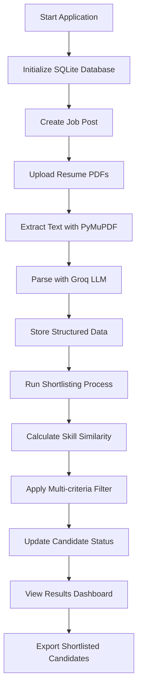

# 🎯 Smart Resume Shortlisting System

An AI-powered resume screening and candidate shortlisting application that automates the recruitment process using machine learning and natural language processing. Built with Streamlit for HR professionals to efficiently manage large volumes of job applications.

## 🌟 Key Features

- **Automated Resume Parsing**: Extract structured information from PDF resumes using Groq LLM
- **Intelligent Skill Matching**: Calculate semantic similarity between candidate skills and job requirements
- **Multi-criteria Shortlisting**: Filter candidates based on CGPA, experience, and skill compatibility
- **Batch Processing**: Handle multiple resumes simultaneously with progress tracking
- **Interactive Dashboard**: User-friendly interface for HR workflow management
- **Export Functionality**: Download shortlisted candidates as CSV files
- **Real-time Processing**: Live feedback during resume analysis and shortlisting

## 🛠️ Technology Stack

- **Frontend**: Streamlit (Interactive web interface)
- **AI/ML**: 
  - Groq LLM (Llama3-8b-8192) for resume parsing
  - SentenceTransformers for semantic skill matching
  - Scikit-learn for similarity calculations
- **Database**: SQLite for data persistence
- **PDF Processing**: PyMuPDF (fitz) for text extraction
- **Data Processing**: Pandas, NumPy for data manipulation

## 📋 Prerequisites & Installation

### Requirements
- Python 3.8 or higher
- Groq API Key ([Sign up here](https://console.groq.com/))

### Installation Steps
```bash
# Clone the repository
git clone <repository-url>
cd smart-resume-shortlisting

# Install dependencies
pip install streamlit pandas scikit-learn sentence-transformers PyMuPDF groq numpy

# Run the application
streamlit run app.py
```

### Setup Groq API
1. Create account at [Groq Console](https://console.groq.com/)
2. Generate API key
3. Enter API key in the application sidebar

## 🔄 System Architecture & Flow

### Complete Workflow


### Detailed Process Flow

#### 1. Job Post Creation
- HR creates job posting with title, description, and requirements
- Define required skills (comma-separated list)
- Set minimum CGPA and experience thresholds
- Store job post in SQLite database

#### 2. Resume Processing Pipeline
**Upload Phase:**
- Select target job post for applications
- Upload multiple PDF resumes simultaneously
- Real-time progress tracking during processing

**AI Parsing Phase:**
```
PDF Resume → Text Extraction → Groq LLM → Structured JSON
```
**Extracted Data Structure:**
```json
{
  "full_name": "John Doe",
  "email": "john@example.com",
  "phone": "+1234567890",
  "skills": ["Python", "Machine Learning", "SQL", "Git"],
  "cgpa": 8.5,
  "experience_years": 3,
  "education": [{"degree": "BTech", "university": "XYZ University"}],
  "projects": [{"title": "ML Project", "description": "Built recommendation system"}],
  "certifications": ["AWS Certified Developer"]
}
```

#### 3. Intelligent Shortlisting Algorithm
**Multi-criteria Evaluation:**
1. **CGPA Check**: candidate_cgpa ≥ minimum_required_cgpa
2. **Experience Check**: candidate_experience ≥ minimum_required_experience  
3. **Skill Similarity**: cosine_similarity(candidate_skills, job_skills) ≥ threshold

**Similarity Calculation:**
- Convert skills to embeddings using SentenceTransformers
- Calculate cosine similarity between candidate and job skill vectors
- Configurable similarity threshold (default: 0.65)

**Final Decision Logic:**
```
IF (CGPA ✓ AND Experience ✓ AND Skills ✓) 
  THEN Status = "Shortlisted"
  ELSE Status = "Rejected"
```

#### 4. Results & Analytics
- Summary dashboard with key metrics
- Detailed candidate profiles with scores
- Export shortlisted candidates to CSV
- Individual candidate management (view/delete)

## 🎛️ Application Interface

### Navigation Pages

1. **Create Job Post**
   - Job title and detailed description
   - Required skills input (comma-separated)
   - Minimum CGPA and experience settings
   - Form validation and success feedback

2. **View Job Posts** 
   - List all created job postings
   - Expandable cards with full job details
   - Delete functionality for unwanted posts

3. **Upload Resumes**
   - Job post selection dropdown
   - Multiple PDF file upload interface
   - Real-time processing status updates
   - Error handling for failed uploads

4. **Shortlist Candidates**
   - Job selection and requirement display
   - Adjustable similarity threshold slider
   - Automated evaluation with progress bar
   - Success confirmation with metrics

5. **View Results**
   - Summary metrics (Total, Shortlisted, Rejected)
   - Detailed candidate cards with all information
   - Status indicators (✅ Shortlisted, ❌ Rejected)
   - CSV export functionality

## 🗄️ Database Schema

### job_posts Table
```sql
CREATE TABLE job_posts (
    id INTEGER PRIMARY KEY AUTOINCREMENT,
    job_title TEXT NOT NULL,
    job_description TEXT NOT NULL,
    required_skills TEXT NOT NULL,
    min_cgpa REAL NOT NULL,
    min_experience INTEGER NOT NULL,
    created_at TIMESTAMP DEFAULT CURRENT_TIMESTAMP
)
```

### candidates Table
```sql
CREATE TABLE candidates (
    id INTEGER PRIMARY KEY AUTOINCREMENT,
    job_id INTEGER,
    candidate_name TEXT NOT NULL,
    full_name TEXT,
    email TEXT, phone TEXT,
    skills TEXT,  -- JSON array
    cgpa REAL,
    experience_years INTEGER,
    education TEXT,  -- JSON array
    projects TEXT,   -- JSON array
    certifications TEXT,  -- JSON array
    resume_text TEXT,
    similarity_score REAL,
    status TEXT,
    created_at TIMESTAMP DEFAULT CURRENT_TIMESTAMP,
    FOREIGN KEY (job_id) REFERENCES job_posts (id)
)
```

## ⚙️ Configuration & Settings

### AI Model Configuration
```python
# Groq LLM Settings
model = "llama3-8b-8192"
temperature = 0.1
max_tokens = 4000

# Sentence Transformer
embedding_model = "all-MiniLM-L6-v2"
```

### Default Thresholds
- **Skill Similarity Threshold**: 0.65 (adjustable via slider)
- **Resume Text Limit**: 4000 characters for LLM processing
- **Batch Processing**: Unlimited PDF uploads


## 🚀 Usage Example

### Complete Workflow Example
```
1. Create Job Post:
   - Title: "Senior Software Engineer"
   - Skills: "Python, Django, React, PostgreSQL, AWS"
   - Min CGPA: 7.5, Min Experience: 3 years

2. Upload Resumes:
   - Upload 25 candidate PDF resumes
   - System processes each resume with AI parsing

3. Run Shortlisting:
   - Set similarity threshold to 0.7
   - System evaluates all candidates automatically
   - Results: 8 shortlisted, 17 rejected

4. Export Results:
   - Download shortlisted_candidates_20241201_143022.csv
   - Share with hiring team for interviews
```

## 🔍 Error Handling & Troubleshooting

### Built-in Error Handling
- PDF text extraction failures with user feedback
- Groq API connection issues and retry mechanisms
- JSON parsing errors with fallback processing
- Database connection problem resolution
- Invalid file format detection and warnings

### Common Issues & Solutions

**Installation Issues:**
```bash
# If PyMuPDF installation fails
pip install --upgrade pip
pip install PyMuPDF

# If sentence-transformers has issues
pip install torch torchvision
pip install sentence-transformers
```

**Runtime Issues:**
- **Groq API Errors**: Verify API key and internet connection
- **Database Locked**: Restart application if SQLite locks occur
- **Memory Issues**: Process resumes in smaller batches for large datasets

